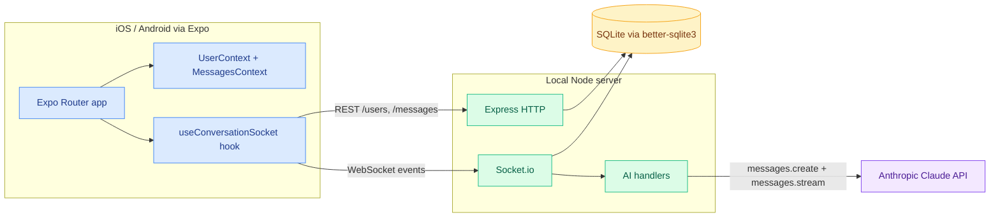
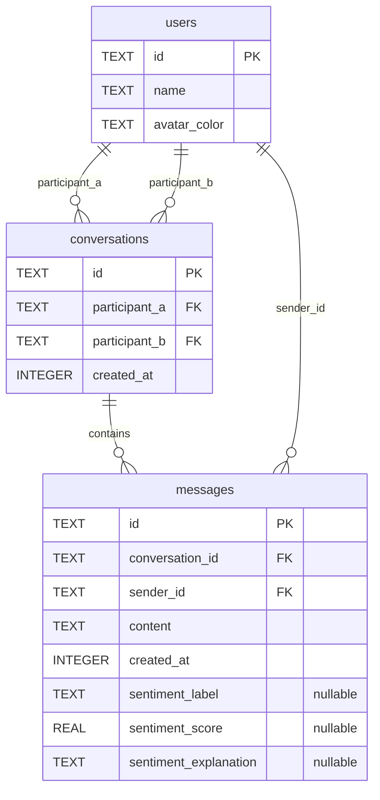
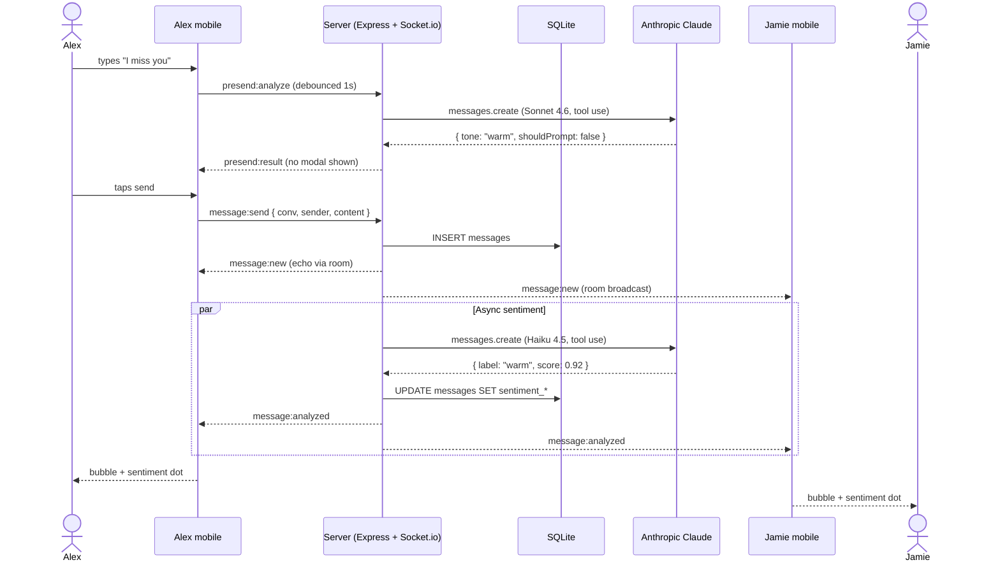
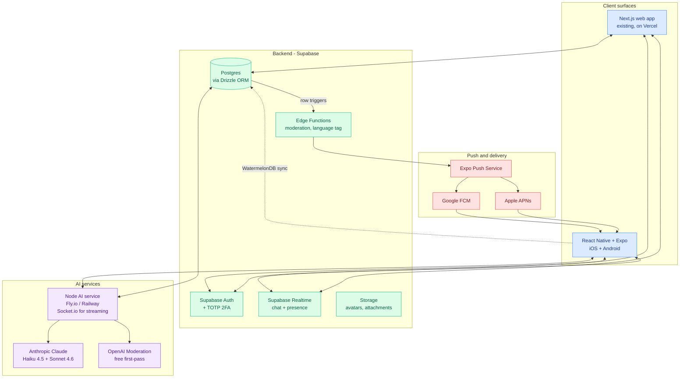
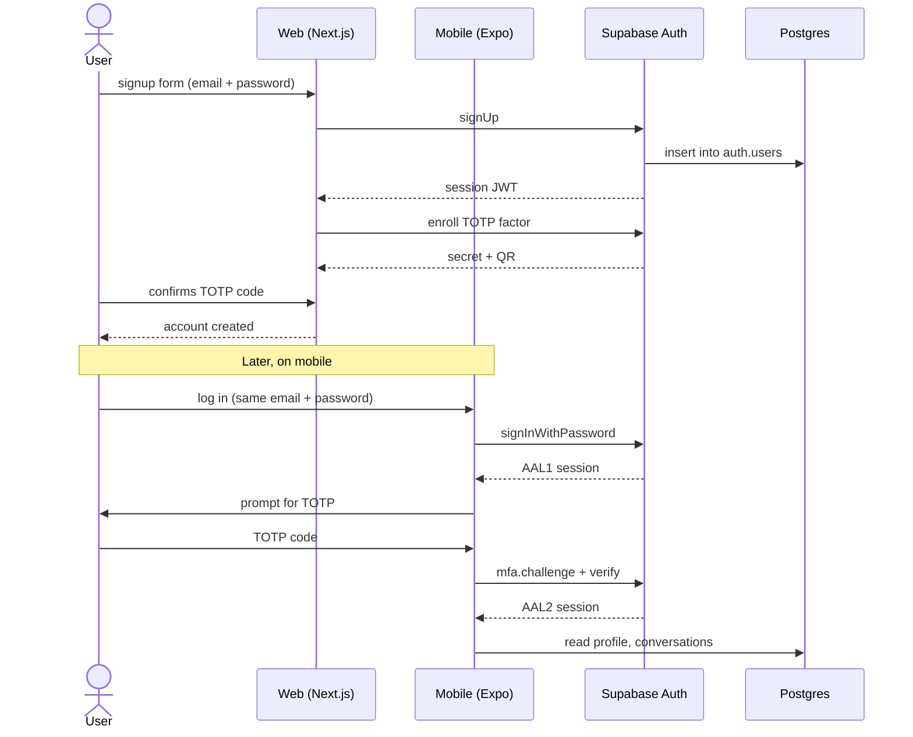
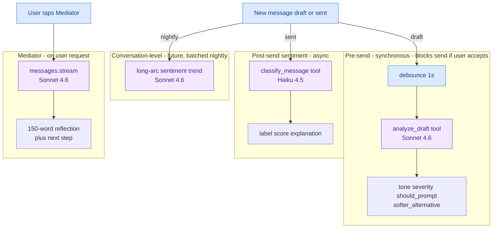

# Jingles — Architecture

This document describes the system architecture for the Jingles product: the working mobile + AI demo, the production system the demo represents, and the integration plan with the existing Next.js web app. Audience: client decision-makers and any AI tool used to interrogate the plan.

---

## 1. Executive Summary

Jingles is a couples-communication app. Two people chat. **After** a message is sent, a small AI sentiment label fades in below the bubble — words like "warm", "defensive", or "vulnerable" — typically within a second or two. The sender doesn't see this on their own draft; sentiment is post-send only. **Before** sending, a separate pre-send check looks at the draft itself and, if it reads as critical or defensive, slides up a soft prompt with a rewrite suggestion the sender can accept or override. At any point, either person can summon a neutral AI mediator that streams a short reflection of both perspectives plus one concrete next step.

The product spans **two codebases**. The client already has a **Next.js + Supabase web app** (landing, signup, account portal — roughly 50–60% complete per the client's AI analysis, pending verification). The chat experience and AI features will live primarily in a **new React Native + Expo mobile app**, which the demo represents end-to-end.

The 24-hour demo proves the mobile half. It runs on a Node + Socket.io + SQLite local stack, hits the Anthropic Claude API directly for sentiment (`claude-haiku-4-5`), pre-send analysis, and a streaming mediator (`claude-sonnet-4-6`), and renders an iMessage-style chat with animated sentiment indicators, a streaming mediator overlay, a slide-up pre-send modal, and a typing indicator. All three AI flows hit the live Anthropic API and return real responses in seconds.

Tech choices, one-liner each: **React Native + Expo** because it eliminates Xcode/Android friction for cross-platform shipping; **Supabase** because the web app is already on it and it gives auth, Postgres, realtime, and storage in one stack; **Anthropic Claude** because tool use returns reliable structured JSON for sentiment and pre-send, and because Sonnet's mediator output reads as nuanced and non-prescriptive; **Socket.io for AI streaming** because Supabase Realtime doesn't natively stream chunked tokens; **Drizzle ORM** for backend type-safety against Postgres; **WatermelonDB** on mobile for offline-first message storage; **Turborepo + pnpm** so web and mobile share types and Zod schemas through `packages/shared`.

---

## 2. Project Scope

**What exists today (web).** A Next.js + Supabase web app with auth scaffolding, a signup flow, profile and settings routes, message and room route stubs, and PWA wrappers. The client's AI estimates 50–60% completion. **This estimate is unverified** — a paid repo review in week 1 will produce a real audit.

**What the demo proves (mobile + AI).** A working real-time chat between two pre-seeded users (Alex, Jamie) with: (a) live message broadcast under 200 ms on LAN, (b) post-send sentiment classification appearing under each bubble within ~1.5 s, (c) a streaming AI mediator that reflects both perspectives and ends with a concrete suggestion, (d) a pre-send modal that catches defensive drafts and offers a softer rewrite, (e) a typing indicator. All AI calls hit Claude live; nothing is faked.

**What the engagement delivers.** Three things in parallel: finish the existing web app (complete flows, fix bugs surfaced by review, add 2FA), productionize the mobile app from the demo (Supabase Realtime, WatermelonDB offline, push notifications, store submission), and stand up a shared backend + AI pipeline that both surfaces consume.

**Rough division of effort** (refines after week-1 review):

| Workstream | Estimate |
|---|---|
| Web completion (audit + bug fixes + missing flows + 2FA) | 20–25% |
| Mobile build (productionize the demo to v1 quality) | 55–60% |
| Shared backend + AI pipeline productionization | 15–20% |
| Store submission, polish, beta cycle | 5% |

**The demo is representative of the mobile portion only.** It is not a replacement for the broader engagement.

---

## 3. Current Demo Architecture

> **This section describes the prototype only. It maps to the mobile + AI portion of the production system. The web app is not part of the demo.**

### Component diagram

### Component breakdown

- **Mobile app (`apps/mobile`).** Expo Router (file-based) with one provider tree: `UserProvider` (root) and `MessagesProvider` (per-conversation). One hook owns the socket lifecycle: `apps/mobile/src/lib/use-conversation-socket.ts`. Components: `MessageList`, `MessageBubble`, `MessageInput`, `SentimentIndicator`, `MediatorOverlay`, `PresendModal`, `TypingIndicator`.
- **Server (`apps/server`).** Express + `socket.io` mounted on the same HTTP server. Handlers for `conversation:join`, `message:send`, `mediator:request`, `presend:analyze`, `typing:start`, `typing:stop` live in `apps/server/src/realtime.ts`. AI logic in three files: `sentiment.ts`, `mediator.ts`, `presend.ts`.
- **Database.** SQLite via `better-sqlite3`. Single file at `apps/server/data.db`, WAL mode for crash safety. Three tables, schema in `apps/server/src/db.ts`. Idempotent seed for Alex + Jamie + one conversation.
- **AI provider.** `@anthropic-ai/sdk` v0.65, single client constructed from `ANTHROPIC_API_KEY`. Sentiment uses `claude-haiku-4-5` with tool use; pre-send uses `claude-sonnet-4-6` with tool use; mediator uses `claude-sonnet-4-6` streaming.

### Real-time event flows

| Direction | Event | Trigger | Effect |
|---|---|---|---|
| Client → Server | `conversation:join` | On socket connect | Joins `conv:<id>` room |
| Client → Server | `message:send` | Tap send button | Validates Zod, inserts row, broadcasts `message:new` |
| Server → Clients | `message:new` | After insert | All in-room clients render bubble |
| Server (async) | sentiment analysis | After broadcast | Fires `analyzeSentiment` fire-and-forget |
| Server → Clients | `message:analyzed` | Sentiment returns | Clients merge sentiment by message id |
| Client → Server | `mediator:request` | Tap Mediator pill | Streams Sonnet response to requester only |
| Server → Client | `mediator:chunk` / `:done` / `:error` | Per-token + completion | Mobile buffers + reveals at 6 ms/char |
| Client → Server | `presend:analyze` | Debounced 1 s after typing pause | Awaits Sonnet, replies once |
| Server → Client | `presend:result` | Analysis returns | If `shouldPrompt`, slide-up amber modal |
| Client → Server | `typing:start` / `:stop` | First keystroke / 2 s idle / send | Per-keystroke throttle |
| Server → Other clients | `typing:state` | Forwards to room minus sender | Other client shows pulsing dots |

### Data model

### Message lifecycle

---

## 4. Production Architecture

### Component diagram

### Demo vs production differences

| Area | Demo | Production |
|---|---|---|
| Database | SQLite file via better-sqlite3 | Supabase Postgres |
| ORM | Hand-written prepared statements | Drizzle (or Supabase client) |
| Mobile state | In-memory `Map` per conversation | WatermelonDB, offline-first |
| Auth | None — account picker | Supabase Auth + TOTP 2FA, shared web/mobile |
| Realtime | Local Socket.io for everything | Supabase Realtime for chat; small Node service for AI streaming |
| Push | None | Expo Push → APNs / FCM |
| Hosting | `pnpm dev` on localhost | Web on Vercel; AI Node service on Fly.io or Railway; mobile via EAS Build |
| AI safety | Sentiment + tool use only | OpenAI Moderation as free first pass; Anthropic with no-training agreement |
| Cost control | None | Prompt caching on Sonnet system prompts; Haiku for sentiment; conversation-level analysis batched |

### Auth flow

Single Supabase Auth identity is shared between web and mobile. Sign up on either surface; the same `users` row in `auth.users` works for both. JWTs are stored securely (cookies on web, `expo-secure-store` on mobile). Sessions refresh transparently. 2FA uses TOTP (Authenticator apps); recovery codes generated at setup.

### Offline-first sync (mobile)

WatermelonDB keeps the canonical local copy of conversations and messages on the device. Writes go to WatermelonDB first, then enqueue for server sync. Reads always hit the local DB — UI never blocks on the network.

The sync engine pulls changes since the last sync timestamp (`pulled_at`) from a Supabase Edge Function, applies them, then pushes locally created or modified rows. Conflicts are rare because messages are append-only; the server is the source of truth for `created_at` (server-assigned timestamp) and the canonical `id` (server-generated UUID echoed back via Supabase Realtime). Optimistic UI uses a temporary `clientTempId` that the server echoes in the broadcast for reconciliation.

### Push notifications

Postgres row triggers fire on new `messages` rows. A Supabase Edge Function reads the message, looks up the recipient's Expo Push token, and submits a push request to Expo Push Service. Expo routes to APNs (iOS) or FCM (Android). Notification payload includes the conversation ID for deep-link routing. Recipient's mobile app opens to that conversation on tap.

### Multilingual handling

A lightweight language tag per message is set client-side on send (browser/device locale) and verified server-side via a fast model (Haiku) on first message of a conversation. AI prompts are localized: the mediator's system prompt and the pre-send tool descriptions ship in a small set of languages at launch (TBD with client). Sentiment labels remain canonical English internally and are localized at render time on the client.

### Cost control

Claude prompt caching is structured around stable prefixes: the mediator system prompt (~150 tokens) and the per-conversation last 20 messages are cached when invoked twice within the 5-minute TTL. The demo already implements an in-memory cache keyed by `(conversationId, lastMessageId, requesterId)` that returns identical mediator responses instantly when nothing has changed (verified ~50 ms vs ~7 s for fresh calls). In production this becomes Redis or Postgres-backed. Sentiment runs Haiku 4.5 (1/5 the cost of Sonnet for a per-message hot path); mediator and pre-send run Sonnet 4.6. OpenAI's free moderation API is the first-pass content gate before AI calls.

---

## 5. Web App Integration Plan

The existing Next.js web app is the **marketing surface, signup, and account portal**. It may also host a "lite" web chat surface in v1 if scope permits. The mobile app remains the primary product experience.

**Single source of truth.** Both clients hit Supabase. Auth, profile data, conversations, and messages all live in Postgres. The mobile app does not maintain a separate auth or profile system. A user signing up on web and then installing the mobile app gets seamless cross-device login.

**Code sharing through the monorepo.** `packages/shared` holds the user, message, conversation, sentiment, and pre-send analysis types, plus the Zod validation schemas. Web (Next.js) and mobile (Expo) both import from it. Adding a `packages/api-client` (already present in the demo) gives both surfaces the same typed Supabase client wrappers. This means: a schema change made for mobile is instantly available on web, and vice versa, with TypeScript catching any mismatch at compile time.

**Items the client's AI flagged for attention** (verbatim categories from the analysis):

- Backend / API wiring on routes that are scaffolded but not connected
- Navigation flows between auth, profile, room, and messages
- Validation and error handling gaps (forms, server-side checks)
- QA passes on existing flows
- Deployment hardening (env config, redirects, error pages)
- 2FA implementation (Supabase Auth supports TOTP; needs UI + recovery codes)

**Caveat.** These items reflect the client's AI's read of the codebase, not a hands-on review. Week 1 includes a full code audit. Expect the list to refine — some items may be smaller than the AI claims, others may surface that it missed (test coverage, security issues, dependency drift).

**Refactor stance: finish-as-is.** Unless the week-1 review surfaces blockers (breaking architectural choices, severe security issues, dead-ended dependencies), the plan is to finish the web app's incomplete portions rather than rewrite. Refactoring 50%-complete code on a tight timeline is high-risk; finishing is predictable.

---

## 6. AI Pipeline Architecture

### Model selection per layer

| Layer | Model | Why |
|---|---|---|
| Sentiment (every message) | `claude-haiku-4-5` | Hot path; cheapest; tool use returns structured output reliably; ~1.5 s |
| Pre-send analysis | `claude-sonnet-4-6` | Needs nuance for "softer alternative" rewrite; ~2.5 s acceptable since user is paused |
| Mediator | `claude-sonnet-4-6` | Reflective tone matters; streaming gives the wow factor; ~6 s for 1000 chars |
| Conv-level trends (future) | `claude-sonnet-4-6` | Batched nightly; cost amortized |

### Prompt caching strategy

Cache breakpoints sit on stable prefixes:

- Mediator system prompt (the principles list) — stable, cached.
- Pre-send tool definition + system prompt — stable, cached.
- Sentiment tool definition — stable, cached.
- Per-conversation history is **not** cached at the request level (changes too often) but the mediator's in-memory response cache keyed by `(conversationId, lastMessageId, requesterId)` short-circuits identical re-invocations. Expected hit rate: 30–50% during active conversations where the mediator is tapped multiple times before the next message arrives.

### Privacy and safety

- **Moderation first.** Every draft hits the OpenAI Moderation API (free) before any AI call. Drafts flagged for sexual content involving minors, self-harm, or violence are blocked at the client with a generic message. No Anthropic call is made.
- **No training.** Anthropic's enterprise terms are negotiated to opt out of any training use. (To-do: confirm this is included in the standard Pro/Team API tier or requires a custom agreement.)
- **What is logged.** Per-message: `id`, `conversation_id`, `sender_id`, `content`, `created_at`, sentiment label/score/explanation. Logs are retained for the user's account and can be deleted on account deletion (GDPR / CCPA compliant).
- **What is not logged.** Pre-send drafts that the user discarded ("Send anyway" → original or "Use this" → softer is the only state that lands in storage; abandoned drafts are not persisted). Mediator responses are ephemeral by design — not stored unless the user explicitly saves one (future feature).

### Latency management

- Sentiment runs **after** the message is broadcast, never blocking it. The bubble appears instantly; the dot fades in 1–2 seconds later.
- Pre-send runs **before** send only on a 1 s debounce after typing pauses; never on every keystroke.
- Mediator **streams** chunks via Socket.io; the mobile client buffers them and reveals at 6 ms per character (~165 chars/sec) for a smooth ChatGPT-style typing effect.
- **Both web and mobile** consume the same AI pipeline. Investment in caching, moderation, and prompt engineering benefits both surfaces.

---

## 7. Roadmap (10–11 weeks)

| Week | Surface | Deliverables |
|---|---|---|
| 1 | Both | (a) Hands-on review of existing web repo, audit doc; (b) Expo project scaffolded; (c) Monorepo set up with `packages/shared`, `packages/api-client`; (d) Supabase project provisioned with schema migrations |
| 2 | Both | (a) Supabase Auth wired on web + mobile; (b) TOTP 2FA enroll + verify on web; (c) Auth state synced across surfaces; (d) Signup flow finalized on web |
| 3 | Web | (a) Profile + settings + account routes completed; (b) Critical bugs from week 1 audit fixed; (c) Web validation + error handling pass; (d) Deployment hardening (env, redirects) |
| 4 | Mobile | (a) Conversation list + screen built; (b) Supabase Realtime subscribed for new messages; (c) WatermelonDB schema + adapter; (d) iMessage-style bubbles ported from demo |
| 5 | Mobile | (a) Offline-first sync engine wired; (b) Send-while-offline reconciliation; (c) Optimistic UI with `clientTempId`; (d) Pull-to-refresh and pagination |
| 6 | Mobile | (a) Push notification scaffolding (Expo Push token registration, server endpoint); (b) Edge Function for message-row → push; (c) Deep links from notification; (d) Background fetch for missed messages |
| 7 | Both | (a) AI Node service deployed (Fly.io or Railway); (b) Sentiment + pre-send + mediator wired against Supabase data model; (c) OpenAI Moderation first pass; (d) Rate limiting + spend caps |
| 8 | Both | (a) Mediator streaming via Socket.io to mobile and web; (b) Web "lite" chat surface if scope permits; (c) Prompt caching tuned; (d) End-to-end AI flow QA |
| 9 | Both | (a) i18n string extraction across web + mobile; (b) Translation pass for launch languages (TBD); (c) Localized AI prompts; (d) Visual polish + animation tuning |
| 10 | Both | (a) Web production deploy on Vercel; (b) iOS TestFlight internal build; (c) Android Play Console internal track; (d) Beta cycle with client + selected testers |
| 11 | Both | (a) Bug fix buffer; (b) App Store + Play Store submission packets; (c) Marketing site updates if needed; (d) Handover documentation |

---

## 8. Decisions Log

- **Decision:** Supabase Realtime for chat; small Node service for AI streaming. **Why:** the existing web app is already on Supabase, so realtime + auth + Postgres ride on the same stack at zero added complexity. AI streaming needs token-by-token delivery which Supabase Realtime doesn't model — a small Socket.io service handles that. **Alternatives considered:** Firestore (lock-in, web app would have to migrate); Stream Chat (excellent product but adds a third vendor and doesn't help the AI streaming case).
- **Decision:** React Native via Expo managed workflow. **Why:** eliminates Xcode/Android Studio config; OTA updates via EAS; works on physical devices via QR or development build. **Alternatives considered:** bare React Native (more flexibility, slower delivery, more native debug surface area for a small team); Flutter (different ecosystem, can't share TS types with the Next.js web app).
- **Decision:** Drizzle ORM on the Node side; Supabase JS client where convenient. **Why:** Drizzle is the lightest type-safe Postgres ORM in TS; schema is the source of truth; migrations are simple. **Alternatives considered:** Prisma (heavier, generated client, slower cold starts on serverless); raw SQL (fine for a demo, doesn't scale to 30+ queries).
- **Decision:** WatermelonDB for offline-first mobile storage. **Why:** designed for sync; lazy-loads at 10K+ messages without lag; battle-tested in Nozbe and other large RN apps. **Alternatives considered:** `expo-sqlite` directly (lower-level, no sync engine, would mean writing one); Realm (great but heavier, schema changes are awkward); MMKV (key-value only).
- **Decision:** Anthropic Claude (Sonnet + Haiku). **Why:** tool use returns clean structured JSON for sentiment and pre-send (verified in the demo); Sonnet's mediator output is unusually nuanced and non-prescriptive, exactly the tone the product needs. Pricing tiers cover the cost shape (Haiku for hot path, Sonnet for thoughtful tasks). **Alternatives considered:** OpenAI GPT-4o (also good; the Anthropic terms around training and the tone of mediator output tipped it).
- **Decision:** Turborepo + pnpm monorepo. **Why:** web + mobile share `packages/shared` for types and Zod schemas, and `packages/api-client` for the typed Supabase wrapper. Schema change in one place, both surfaces update. **Alternatives considered:** separate repos (duplicated types, drift); Nx (heavier, more configuration than the team needs).
- **Decision:** Finish the existing web app rather than rewrite. **Why:** half-rewrites on tight timelines lose more than they gain; the existing code is on a sane stack (Next.js + Supabase) and can be brought to v1 quality. **Alternatives considered:** rewrite from scratch in 2026's Next.js patterns (only if week-1 audit surfaces blockers, e.g. severe security issues or unworkable architecture).

---

## 9. Open Questions for the Client

1. **Repo access.** Need write access (or fork) to the existing web repo by start of week 1 for the audit. Who grants access?
2. **Sign language scope.** Is sign language recognition (camera-based) a v1 feature, post-v1 roadmap, or out of scope? This shifts mobile scope significantly.
3. **Languages at launch.** English only, English + one other (Spanish? Hindi? Nepali?), or a broader set? Drives i18n week (week 9) and AI prompt translation cost.
4. **Design availability.** Are mobile screens designed already (Figma)? If not, what's the design source — does the team have a designer, or do we work from the demo as a baseline and iterate?
5. **AI provider preference + billing.** Confirm Anthropic Claude is preferred. Does the client own the API key and billing, or does the engagement?
6. **iOS + Android at launch, or staged?** Both at launch is ~1 week extra (Play Console specifics, Android-only edge cases). iOS-only at launch is faster. Which wins?
7. **Decision-maker.** On product calls (feature priorities, design choices, scope cuts) — who's the final yes/no? Sole CEO call, or are there other stakeholders?

---

*Last updated: 2026-05-03. Demo commit reference: see `git log` in the project root for the full Phase 1–10 build history.*
